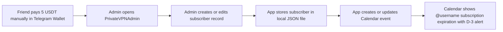

# Private VPN Project

Native macOS admin app for manual VPN subscription tracking.

Public repository: <https://github.com/Nehoko/private-vpn-project>

## Stack

- `admin-macos`: native `SwiftUI` app
- local JSON persistence in Application Support
- Apple Calendar integration through `EventKit`
- GitHub Actions release workflow for macOS installer

## Manual flow

1. Friend pays `5 USDT` in Telegram wallet manually.
2. Admin opens macOS app.
3. Admin creates or updates subscriber record manually.
4. App stores subscriber locally.
5. App creates or updates Calendar event:
   - title: `@username subscription expiration`
   - calendar: `Private VPN Admin`
   - alert: `D-3`

Telegram Wallet API is closed for newcomers. No backend, no webhook, no Kafka, no server sync in this version.

## Features

- full local CRUD for subscribers
- native sidebar/detail macOS UI
- clickable Telegram username and Telegram ID that open Telegram chat
- per-subscriber VPN configuration attachment
- active/inactive and expiring-soon filters
- relative last-update label:
  - `today at hh:mm:ss`
  - `yesterday at hh:mm:ss`
  - `n days ago at hh:mm:ss`
- Calendar event sync on create/edit/delete
- `Sync Calendar` action to rebuild reminders

## Subscriber fields

- `first_name`
- `last_name` optional
- `telegram_username`
- `telegram_id`
- `start_date`
- `next_payup_date`
- `active`

## Calendar integration

App requests Calendar permission on first reminder sync.

For active subscriber app creates event in app-managed `Private VPN Admin` calendar:

- title: `@username subscription expiration`
- event date: `next_payup_date`
- all-day: `true`
- alert: `3 days before`

If subscriber becomes inactive or deleted, app removes linked calendar event.

## Local run

```bash
cd apps/admin-macos
swift build
swift run PrivateVPNAdmin
```

## Persistence

App stores local data at:

```txt
~/Library/Application Support/PrivateVPNAdmin/subscribers.json
```

VPN configuration attachments stored under:

```txt
~/Library/Application Support/PrivateVPNAdmin/vpn-configs/
```

## Release packaging

Build installer locally:

```bash
./scripts/package_admin_macos.sh
```

Output:

```txt
dist/PrivateVPNAdmin.dmg
```

## Installer

GitHub release publishes unsigned drag-and-drop DMG installer.

Inside DMG:

- `PrivateVPNAdmin.app`
- symlink to `/Applications`

## Workflow



## Repository shape

- `apps/admin-macos` Swift package for app
- `scripts/package_admin_macos.sh` local installer packaging
- `.github/workflows/release.yml` GitHub release workflow
- `docs/joplin` mirrored wiki pages

## Releases

- GitHub releases publish `PrivateVPNAdmin.dmg`
- workflow triggers on tags like `v0.3.0`

## Status

- manual local-only architecture
- backend removed
- full CRUD in macOS app
- Calendar reminder integration implemented
- app-managed `Private VPN Admin` calendar implemented
- UI polished for release `v0.3.2`
- DMG installer release flow implemented
